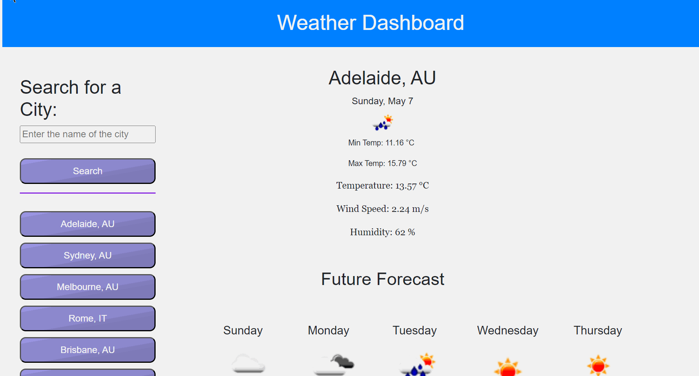
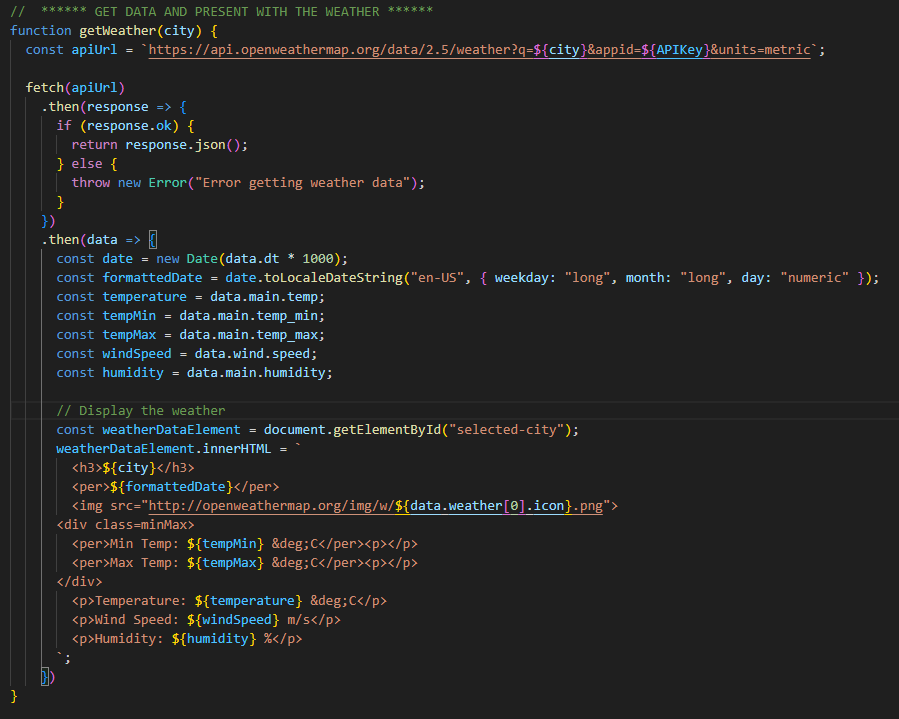

# Server-Side APIs: Weather Dashboard

## Description

This site was developed from scratch, where I got a user story where a traveler wants to explore the weather for several cities before starting his journey, then he is presented with the current weather and the weather for the next few days.

The challenge was to create an HTML structure and an interaction link in JavaScript using an external API (OpenWeatherMap) to collect data.

## Usage
The web page was developed in VS Code, where the structure was created in HTML, CSS and the interaction with the end user was developed in Javascript.

The animation below shows how the page will be presented to the user, so that it is possible to better understand its functionality and how to better interact with it.

It is noteworthy that the user will have the last six searches allocated in his LocalStorage, so he will not need to search for these locations again, just click on them and the expected result will be presented.

## Development & Deployment

The code for creating the site was developed in Javascript, where it was possible to create interaction using events such as "click" on the button to access an API (OpenWeatherMap), which will return the required data.

The screenshot below shows the code where a function is created to request data from the OpenWeaterMap API.

### Deployed Website

To visit the website, use the link below.

https://robinsonfdossantos.github.io/Weather_Dashboard/

For more information, use the browser's DevTools by typing Ctrl + Shift + I.

## Credits

Meeks Gombe, Dominique who helped me to understand and overcome all my doubts through a 1:1 tutor session.

OpenWeatherMap API.

## License

Licensed under the MIT license.
